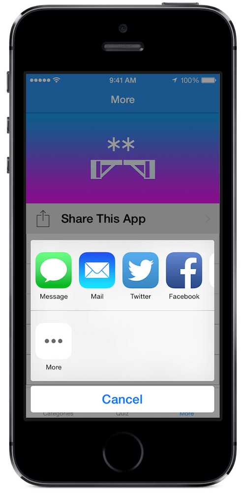

# Share Menu Plugin for the Buzztouch Platform

## About Plugin
### Description
The Share Menu plugin brings the native iOS Sharing Menu to your app. Choose to share with Mail, Messages, Facebook, Twitter, Weibo, Copy to the Pasteboard, Print, Save to the Camera Roll, and Assign to Contact. It also includes options for including URLs and Images. The navigation bar color can be changed after the launch of the ShareMenu. Social Network character and image requirements are listed. This plugin works best when using the "fade" transition.

iOS Version Compatibility Information: The user interface of this plugin is compatible with iOS 6, iOS 7, and iOS 8. This plugin can be compiled on devices running iOS 5 and below. In this legacy operating system scenario, the plugin will display an alert, it will not crash.

### Version History
v1.0-Initial Release of Plugin

v1.1-Updated Plugin Description

v2.0-Updated for BT3.0 Core and Control Panel

--Attach .txt and .pdf Documents to the ShareMenu

--New Error Handling for images and documents

--Fixed display issues with tabbed apps

v2.1-Fixed Compiler Error with BT2.0 Projects

--Adds Document Attachment option to BT2.0 Projects

--Fixed Control Panel Typos

v2.2-Updated for iOS 8

v2.3-Fixed bugs on iPads running iOS 8

v2.4-Fixed display problems and screen transition issues on iOS 8, added new screenshots

### iOS Project
JC_ShareController.h

JC_ShareController.m

### Android Project
This plugin is not compatible with Android.

### JSON Data
`{
"itemId":"123456789",
"itemType":"JC_ShareController",
"itemNickname":"Share Controller",
"shareMail":"1", "shareMessage":"1",
"shareFacebook":"1",
"shareTwitter":"1",
"shareWeibo":"1",
"shareCopy":"1",
"sharePrint":"1",
"shareCameraRoll":"1",
"shareContact":"1",
"shareLocalImage":"logo.png"
}`

## Screenshots

## Installation
If a previous version of this plugin is installed on your server that was downloaded from the Buzztouch Plugin Market, we reccomend that you delete this plugin's folder under /filed/plugins/ and then upload the new package and refresh your plugin list.

## Questions and Answers
Can I use this plugin on my self-hosted Buzztouch account?

*Yes, you can download the plugin from this repository as a zip file, and upload it to your Buzztouch self-hosted Control Panel*

Can I use this plugin on apps hosted at Buzztouch.com?

*Yes, but you must install it through the [Buzztouch Plugin Market](http://www.buzztouch.com/plugins/plugin.php?pid=2C64C67C961948B1A03DBA0).*

## Collaboration
To become a collaborator with this project, please contact us on either our [Twitter](http://twitter.com/jakechasan) or our [Facebook](http://facebook.com/jakechasanapps) pages.

## Support
For support and further questions, please contact us on either our [Twitter](http://twitter.com/jakechasan) or our [Facebook](http://facebook.com/jakechasanapps) pages.

Support is also availible from other Buzztouch users on the [Buzztouch Forums](http://www.buzztouch.com/forum/).